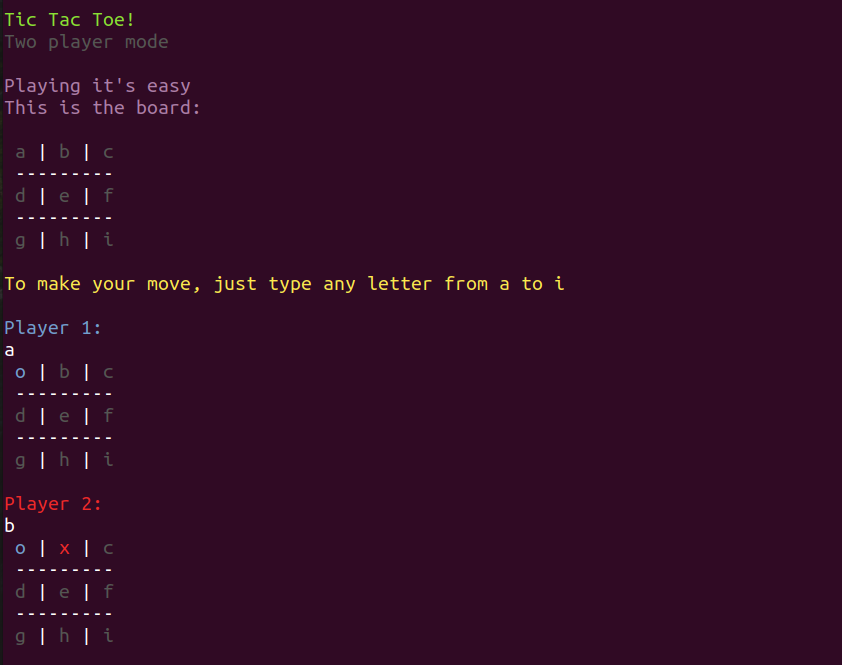

# Tic Tac Toe!
The classic game "tic-tac-toe" or "noughts and crosses", playable in terminal, made for [The Odin Project: Ruby Programming course.](https://www.theodinproject.com/courses/ruby-programming)

## Built With

- Ruby
- Colorize gem

## Live Demo

[Click here to play](https://repl.it/@Kuawi/tic-tac-toe)

## Author

👤 **Jose L. Lozano**

GitHub: [@kuawi](https://github.com/kuawi)

## Contributing

As this is merely a learning project it's not open to contributions, however, all feedback would be appreciated so feel free to highlight any issues.

## 📝 License

This project is [MIT licensed.](LICENSE)
